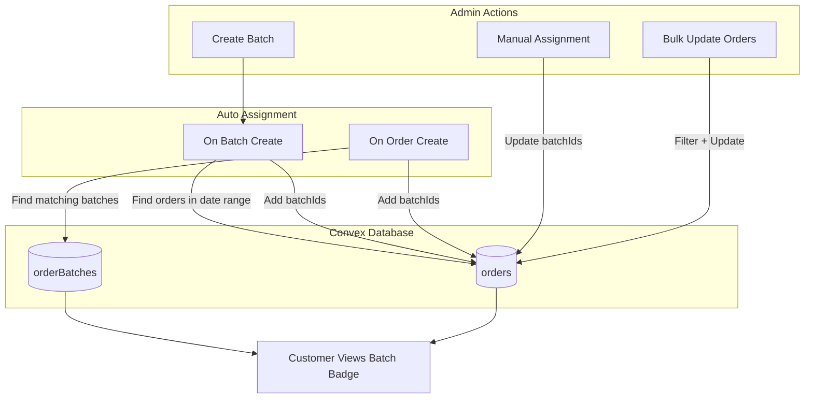

# Order Batch Feature Implementation

## Summary of Requirements

Based on your input:

- **Assignment**: Manual + automatic (by order date within batch date range)
- **Exclusivity**: Orders can belong to multiple batches (tags-like)
- **Bulk Updates**: Update only orders matching current filters within a batch
- **Customer Display**: Subtle badge next to order number/status
- **Lifecycle**: Soft delete (orders retain historical batch reference)
- **Auto-assignment**: On both order creation AND batch creation
- **Admin UI**: Dedicated `/admin/batches` page + quick access from orders list

---

## Phase 1: Database Schema

### New Table: `orderBatches`

Create [convex/models/orderBatches.ts](convex/models/orderBatches.ts):

```typescript
export const orderBatches = defineTable({
  organizationId: v.id('organizations'),
  name: v.string(),                    // e.g., "December Week 1"
  description: v.optional(v.string()),
  startDate: v.number(),               // Timestamp - start of date range
  endDate: v.number(),                 // Timestamp - end of date range
  isActive: v.boolean(),               // For toggling visibility
  isDeleted: v.boolean(),              // Soft delete
  createdById: v.id('users'),
  createdAt: v.number(),
  updatedAt: v.number(),
})
  .index('by_organization', ['organizationId'])
  .index('by_organization_active', ['organizationId', 'isActive'])
  .index('by_date_range', ['organizationId', 'startDate', 'endDate']);
```

### Update Orders Table

Modify [convex/models/orders.ts](convex/models/orders.ts) to add:

```typescript
// Add to orders table
batchIds: v.optional(v.array(v.id('orderBatches'))),
batchInfo: v.optional(v.array(v.object({
  id: v.id('orderBatches'),
  name: v.string(),
}))),
```

Add index: `.index('by_batch', ['batchIds'])`

---

## Phase 2: Backend (Convex Functions)

### Directory Structure

```
convex/orderBatches/
├── mutations/
│   ├── createBatch.ts          # Create batch + auto-assign orders
│   ├── updateBatch.ts          # Edit batch details
│   ├── deleteBatch.ts          # Soft delete
│   ├── assignOrdersToBatch.ts  # Manual assignment
│   ├── removeOrdersFromBatch.ts
│   └── bulkUpdateBatchOrders.ts # Bulk status/payment update with filters
├── queries/
│   ├── getBatches.ts           # List batches for org
│   ├── getBatchById.ts         # Single batch details
│   └── getBatchOrders.ts       # Orders in batch with filters
└── index.ts
```

### Key Logic

**Auto-assignment on batch creation:**

```typescript
// When creating a batch with date range, find all orders
// where orderDate >= startDate AND orderDate <= endDate
// and add this batch to their batchIds array
```

**Auto-assignment on order creation:**

```typescript
// In createOrder mutation, after creating order:
// Find all active batches where order.orderDate falls within range
// and add those batch IDs to the order's batchIds
```

**Bulk update with filters:**

```typescript
// bulkUpdateBatchOrders mutation accepts:
// - batchId
// - filters: { status?, paymentStatus? }
// - updates: { status?, paymentStatus? }
// Only updates orders matching ALL filters
```

---

## Phase 3: Admin UI

### New Page: `/admin/batches`

Create [app/(admin)/admin/batches/page.tsx](app/\\(admin)/admin/batches/page.tsx):

- List all batches with stats (total orders, pending, delivered)
- Create batch modal/form with name, description, date range
- Quick actions: edit, archive (soft delete), view orders

### Batch Detail Page: `/admin/batches/[id]`

Create [app/(admin)/admin/batches/[id]/page.tsx](app/(admin)/admin/batches/[id]/page.tsx):

- Batch info header with name, dates, description
- Orders table with filters (status, payment)
- Bulk action bar: Update selected orders' status/payment
- Manual order assignment (search and add orders)

### Enhance Orders Page

Update [app/(admin)/admin/orders/page.tsx](app/\\(admin)/admin/orders/page.tsx):

- Add batch filter dropdown in toolbar
- Add "Batch" column showing batch badge(s)
- Add "Assign to Batch" option in order dropdown menu
- Quick batch assignment modal

### Components to Create

```
src/features/admin/components/batches/
├── batch-list.tsx              # Batches table
├── batch-card.tsx              # Individual batch display
├── batch-form.tsx              # Create/Edit form
├── batch-order-table.tsx       # Orders within batch
├── batch-bulk-actions.tsx      # Bulk update controls
├── batch-assign-modal.tsx      # Assign orders to batch
└── batch-badge.tsx             # Reusable badge component
```

---

## Phase 4: Customer UI

### Orders List

Update [src/features/orders/components/orders-list.tsx](src/features/orders/components/orders-list.tsx):

- Display batch badge(s) next to order number
- Show "(archived)" suffix for soft-deleted batches

### Order Detail

Update [src/features/orders/components/order-detail.tsx](src/features/orders/components/order-detail.tsx):

- Add subtle batch info section below order header
- Display badge with batch name(s)

---

## Data Flow Diagram



---

## Edge Cases Handled

| Scenario | Behavior |

|----------|----------|

| Batch deleted while orders assigned | Soft delete - badge shows with "(archived)" indicator |

| Overlapping batch date ranges | Allowed - orders can be in multiple batches |

| Order date outside any batch range | No automatic assignment; manual assignment available |

| Empty batch (no orders) | Allowed - admin can manually assign later |

| Batch with all delivered orders | Allow editing, no special restriction |

| Order created before any batches exist | Auto-assigned when matching batch is created later |

---

## Files to Create/Modify

**New Files:**

- `convex/models/orderBatches.ts` - Schema definition
- `convex/orderBatches/mutations/*.ts` - 6 mutation files
- `convex/orderBatches/queries/*.ts` - 3 query files
- `app/(admin)/admin/batches/page.tsx` - Batches list page
- `app/(admin)/admin/batches/[id]/page.tsx` - Batch detail page
- `src/features/admin/components/batches/*.tsx` - 7 component files

**Modified Files:**

- `convex/models/orders.ts` - Add batchIds field
- `convex/schema.ts` - Register orderBatches table
- `convex/orders/mutations/createOrder.ts` - Add auto-assignment logic
- `app/(admin)/admin/orders/page.tsx` - Add batch filter + column
- `src/features/orders/components/orders-list.tsx` - Add batch badge
- `src/features/orders/components/order-detail.tsx` - Add batch info